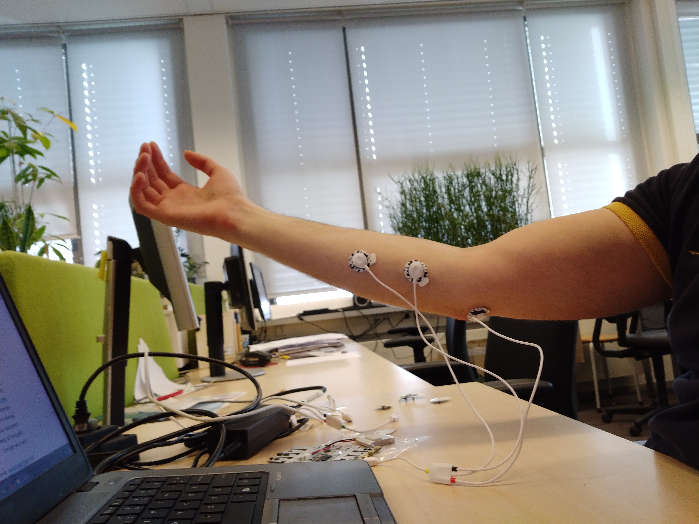
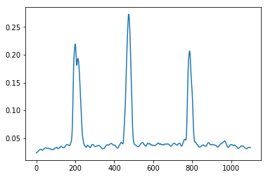

# Bitalino-EMG-psychomotoric-test
Psychomotoric test to measure reaction time using a Bitalino board and EMG as input signal

## Requirements
python3.5 with packages bitalino, numpy, time, random, matplotlib, threading, statsmodels, peakutils, math and your favorite python IDE. If running an Anaconda environment, just install external packages like this:
```
conda install numpy, matplotlib, statsmodels
pip install peakutils
```
bitalino python api from [here](https://github.com/BITalinoWorld/revolution-python-api).

## Disclaimer
The code has only been tested for the forearm flexor carpi radialis muscle. Theoretically it should be able to work for any muscle.
* Sample positioning of the electrodes, where the one on the elbow is the reference electrode. <br/>


## Trial
Consist of two phases, calibration and trial, while instructions are given through the console output.
* In the calibration phase the user is asked to activate their muscle three times in the span of 10 seconds
* During the trial the user is asked to activate their muscle 20 times (can be configured) at [3,6] seconds intervals


### Calibration
During the calibration phase a 10 seconds fragment of the signal is acquired to estimate, whether there is a significant noise in the signal. For example poorly placed arm will generate slight involuntary movements, which will introduce noise to the signal. Movements of the neighboring muscles or muscle groups will introduce significant noise.
Ideally, in this phase there will be three distinguishable peaks in the signal, such as this:<br/>

* The absolute values of the signal is taken as explained [here](https://en.wikipedia.org/wiki/Electromyography#EMG_signal_processing)
* A smoothing ['lowess' local regression filter](https://en.wikipedia.org/wiki/Local_regression) is applied to smoothen the signal
* After successful identification of the three peaks in the signal a threshold value is estimated, which is used later for the trial. The threshold value is calculated to be equidistant from the averaged baseline signal and the highest maximum to allow room for somewhat noisy data
```
baseline = np.mean(filtered[:,1])
max_val = np.max(filtered[:,1])
threshold = (baseline+max_val)/2
```
* Plot is generated of the signal such as this: <br/>

* Peak indexes, peak values, averaged signal baseline and derived threshold are displayed in the console output.
```
Peaks are: [199 474 787]
Peak values are: [0.21902599590374444, 0.27265646132691207, 0.2066513283885936]
Baseline is : 0.052243185529934275
Treshold is : 0.16244982342842318
Calibration successful
```
### Trial
The following variable can be modified to generate shorter or longer trials. In my experience more than 20 instances already introduces fatigue.
```
num_buzz_trig = 20
```
* Buzzer will ring for 0.2 milliseconds to provide the stimulus to prompt the muscle to be actuated
* Peaks are detected in real-time within an envelope frame, by comparing the averaged value to the previously acquired threshold.
* A plot is created for the time difference between the stimulus and the response, such as those:<br/>
<br/>

* A plot is created with the maximum and minimum values, standard deviation and mean, such as those:<br/>
<br/>

The blue line depicts the distribution, with it's extremes on the y-axis denoting the maximum and minimum, while the red line denotes the standard deviation. The black dot is the mean of the obtained values.